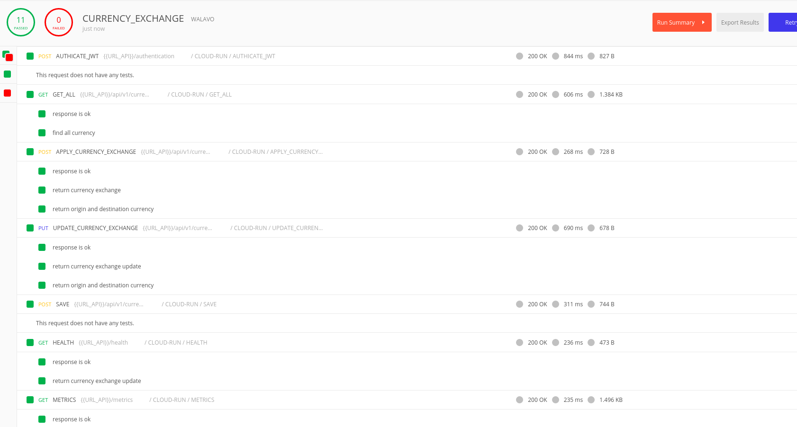

# Building and Deployment Microservice Part I

Spring Boot makes it easy to create decoupled applications and easy to configure.
This helps us in the creation of stand-alone microservices, as we see in the following
example:


**Getting Started** 

  * Spring Boot
  * Spring Security
  * Spring Crud Repository
  * Java RX+
  * H2-DB
  * Swagger 2.0
  * Docker
  * Json Webtoken
  * Lombok
  * Spring Cache
  * Micrometer + Promethues
 
**Previous knowledge**

  :radio_button: Docker
  :radio_button: Spring Boot
  :radio_button: RESTful API
  :radio_button: Swagger
  :radio_button: Postman

**Structure Project**
 
```text
.
├─ currency-exchange
├─── src/main/java
├──── org.jalvarova.currency
│       ├── configuration
│       └── controller
│       └── dto
│       └── exceptions
│       └── mapper
│       └── repository
│       └── service
│       └── util
│       └── CurrencyExchangeApplication.java
├──── resources
│       └── application.yml
│       └── logback.xml
├─── Dockerfile
├─── pom.xml
└─ swagger
    └─ api.yml
```

Spring Data provides **Crud Repository**, programming model for data access while still retaining
the special traits of the underlying data store.

```java
@Repository
public interface CurrencyExchangeRepository extends CrudRepository<CurrencyExchange, Long> {

    @Query(value = "FROM CurrencyExchange e WHERE" +
            " e.currencyExchangeOrigin = :exchangeOrigin AND" +
            " e.currencyExchangeDestination = :exchangeDestination")
    CurrencyExchange findByApplyCurrency(String exchangeOrigin, String exchangeDestination);

    @Query("FROM CurrencyExchange cn")
    List<CurrencyExchange> findAll();
}
```

With Spring Cache we are going to inject data into memory, **@Cacheable("names")** with this annotation we can capture
the response returned by the method to perform caching
 
```java
@Service
@Slf4j
public class CurrencyCodeNamesService implements ICurrencyCodeNamesService {

    @Autowired
    private CurrencyCodeNamesRepository codeNamesRepository;
    
    @Override
    @Cacheable("names")
    public List<CurrencyCodeNames> findAll() {
        log.info("Find all currency code names");
        return Observable
                .fromIterable(codeNamesRepository.findAll())
                .subscribeOn(Schedulers.io())
                .toList()
                .blockingGet();
    }
}
```

Layer Business Logic, we are using **Java RX** to build modern and performance applications, resilient, elastic and reactive.

```java
@Service
@Slf4j
public class CurrencyExchangeService implements ICurrencyExchangeService {

    @Autowired
    private CurrencyExchangeRepository currencyExchangeRepository;

    @Autowired
    private ICurrencyCodeNamesService codeNamesService;

    @Override
    public Single<CurrencyExchangeRsDto> applyExchangeRate(CurrencyExchangeDto dto) {
        String currencyOrigin = dto.getCurrencyOrigin().name();
        String currencyDestination = dto.getCurrencyDestination().name();

        return Single.fromCallable(() -> currencyExchangeRepository.findByApplyCurrency(currencyOrigin, currencyDestination))
                .subscribeOn(Schedulers.io())
                .onErrorReturnItem(CurrencyExchange.instanceEmpty())
                .map(CurrencyUtil::validateNullCurrency)
                .map(x -> toApiApply.apply(x, dto.getAmount()));
    }

    @Override
    public Single<CurrencyExchangeDto> updateExchangeRate(CurrencyExchangeDto dto) {
        String currencyOrigin = dto.getCurrencyOrigin().name();
        String currencyDestination = dto.getCurrencyDestination().name();

        return Single.fromCallable(() -> currencyExchangeRepository.findByApplyCurrency(currencyOrigin, currencyDestination))
                .subscribeOn(Schedulers.io())
                .onErrorReturnItem(CurrencyExchange.instanceEmpty())
                .map(CurrencyUtil::validateNullCurrency)
                .map(x -> toUpdateAmount.apply(x, dto.getAmount()))
                .map(currencyExchangeRepository::save)
                .map(toApi);
    }

    @Override
    public Single<List<CurrencyExchangeDto>> getAllCurrencyExchange() {
        return Single.just(currencyExchangeRepository.findAll())
                .subscribeOn(Schedulers.io())
                .map(CurrencyUtil::validateNullCollection)
                .flatMapObservable(Observable::fromIterable)
                .map(currencyExchange -> toApiList.apply(currencyExchange, codeNamesService.findAll()))
                .toList();
    }

    @Override
    public Observable<CurrencyExchangeDto> saveExchangeRate(List<CurrencyExchangeDto> dtos) {

        return Observable
                .fromIterable(dtos)
                .map(this::saveAll)
                .map(toApiFunc);
    }
}
```

**@FunctionalInterface** we'll create mappers, using the functional and lambda programming features, 
to build the business objects.

```java
@FunctionalInterface
public interface CurrencyMapper {

    void demo();

    Function<CurrencyExchange, CurrencyExchangeDto> toApi = (CurrencyExchange entity) ->
            CurrencyExchangeDto
                    .builder()
                    .currencyOrigin(CurrencyCode.valueOf(entity.getCurrencyExchangeOrigin()))
                    .currencyDestination(CurrencyCode.valueOf(entity.getCurrencyExchangeDestination()))
                    .amount(entity.getAmountExchangeRate())
                    .build();

    BiFunction<CurrencyExchange, List<CurrencyCodeNames>, CurrencyExchangeDto> toApiList = (CurrencyExchange entity, List<CurrencyCodeNames> entities) ->
            CurrencyExchangeDto
                    .builder()
                    .currencyOrigin(CurrencyCode.valueOf(entity.getCurrencyExchangeOrigin()))
                    .nameOrigin(CurrencyUtil.findCurrencyCode(entities, entity.getCurrencyExchangeOrigin()))
                    .currencyDestination(CurrencyCode.valueOf(entity.getCurrencyExchangeDestination()))
                    .nameDestination(CurrencyUtil.findCurrencyCode(entities, entity.getCurrencyExchangeDestination()))
                    .amount(entity.getAmountExchangeRate())
                    .build();

    Function<CurrencyExchange, CurrencyExchangeDto> toApiFunc = (CurrencyExchange entity) ->
            CurrencyExchangeDto
                    .builder()
                    .currencyOrigin(CurrencyCode.valueOf(entity.getCurrencyExchangeOrigin()))
                    .currencyDestination(CurrencyCode.valueOf(entity.getCurrencyExchangeDestination()))
                    .amount(entity.getAmountExchangeRate())
                    .build();

    BiFunction<CurrencyExchange, BigDecimal, CurrencyExchangeRsDto> toApiApply = (CurrencyExchange entity, BigDecimal amount) ->
            CurrencyExchangeRsDto
                    .builder()
                    .amount(amount)
                    .currencyDestination(CurrencyCode.valueOf(entity.getCurrencyExchangeDestination()))
                    .currencyOrigin(CurrencyCode.valueOf(entity.getCurrencyExchangeOrigin()))
                    .exchangeRate(entity.getAmountExchangeRate())
                    .exchangeRateAmount(entity.getAmountExchangeRate().multiply(amount).setScale(5, BigDecimal.ROUND_HALF_UP))
                    .build();

}
```

To expose our API, we will use **@RestController** to define the HTTP operations and the endpoints where
the business layer could be consumed by other applications.
        
```java
@Validated
@RestController
@RequestMapping("api/v1")
public class CurrencyExchangeController {

    @Autowired
    private ICurrencyExchangeService currencyExchangeService;

    @PostMapping(value = "/currency-exchange/apply", produces = MediaType.APPLICATION_JSON_VALUE, consumes = MediaType.APPLICATION_JSON_VALUE)
    public Single<CurrencyExchangeRsDto> getCurrencyExchange(@RequestBody @Valid CurrencyExchangeDto request) {
        return currencyExchangeService.applyExchangeRate(request);
    }


    @PutMapping(value = "/currency-exchange", produces = MediaType.APPLICATION_JSON_VALUE, consumes = MediaType.APPLICATION_JSON_VALUE)
    public Single<CurrencyExchangeDto> updateCurrencyExchange(@RequestBody @Valid CurrencyExchangeDto request) {
        return currencyExchangeService.updateExchangeRate(request);
    }

    @GetMapping(value = "/currency-exchange", produces = MediaType.APPLICATION_JSON_VALUE)
    public Single<List<CurrencyExchangeDto>> getAllCurrencyExchange() {
        return currencyExchangeService.getAllCurrencyExchange();
    }


    @PostMapping(value = "/currency-exchange", produces = MediaType.APPLICATION_JSON_VALUE)
    public Observable<CurrencyExchangeDto> saveCurrencyExchange(@RequestBody @Valid List<CurrencyExchangeDto> request) {
        return currencyExchangeService.saveExchangeRate(request);
    }
    
}
```

### HTTP Operation that exposes our API

| Path | Operation | Summary |
| ------ | ------ | ------ |
|/api/v1/currency-exchange/apply|POST|Aplicar tipo de cambio|
|/api/v1/currency-exchange|GET|Obtener los tipos de cambio|
|/api/v1/currency-exchange|POST|Guardar masivamente el tipos de cambio|
|/api/v1/currency-exchange|PUT| Actualizar el tipos de cambio|


# Container Microservices 

Docker es una perfecta combinacion para poder nuestro microservicios y distribuir nuestras API en entornos Cloud, 
On-premise o probar localmente nuestros microsercios.  

## Docker File Java
```dockerfile
FROM openjdk:8

ENV ARTIFACT_ID=currency-exchange
ENV ARTIFACT_VERSION=1.0.0
ENV APPLICATION_PORT=8080

RUN apt-get update \
	&& apt-get install -y ca-certificates \
	&& update-ca-certificates \
	&& apt-get install -y tzdata
	ENV TZ=America/Lima
	
RUN mkdir -p /${ARTIFACT_ID}/target && mkdir -p /${ARTIFACT_ID}/resources
COPY target/${ARTIFACT_ID}-${ARTIFACT_VERSION}.jar /${ARTIFACT_ID}/target/
COPY src/main/resources/* /${ARTIFACT_ID}/resources/
CMD ["sh","-c","java -jar /${ARTIFACT_ID}/target/${ARTIFACT_ID}-${ARTIFACT_VERSION}.jar -Duser.timezone=America/Lima ${JAVA_OPTS}"]

RUN du -sh /var/cache/apt
```

# Docker Compose Swagger
```yaml
version: '3.7'
services:
  swagger-ui:
    image: swaggerapi/swagger-ui
    container_name: "api-swagger"
    ports:
      - "8080:8080"
    volumes:
      - ./api.yml:/api.yml
    environment:
      SWAGGER_JSON: /api.yml
```

### Docker Build and Docker Run Images
```bash
$ docker login
$ docker build . -t currency-exchange:${ARTIFACT_VERSION}
$ docker images
$ docker run -d --name currency-exchange-local -p 8080:8080 currency-exchange:${ARTIFACT_VERSION}
$ docker ps
$ docker tag currency-exchange gcr.io/${PROJECT_ID}/currency-exchange:${ARTIFACT_VERSION}
```

### Local expose 

```sh
127.0.0.1:8080
```

## Docker delete image
```bash
docker rmi -f $(docker images 'api-swagger' -a -q)
docker rmi -f $(docker images 'currency-exchange' -a -q)
```

### Swagger 

Swagger is a project used to describe and document RESTful API, define http operations, 
path, schemas, security, among others.

[Swagger API](https://swagger-currency-exchange-wcyidxth5q-uc.a.run.app)
 
 
## Postman Collection

Postman collection of the root project: CURRENCY_EXCHANGE.postman_collection.json



### Next step :exclamation::exclamation::exclamation:

    :ballot_box_with_check: Deploy Cloud Run Serveless

    :ballot_box_with_check: Create Pipiline CI/CD with Jenkins

    :ballot_box_with_check: Testing Apí with Postman and Newman

### Conclusions

We've seen in these examples, the creation of microservices with Spring Boot, simple development with functional programming and
how to containerize our REST API quickly and easily. In the following steps, we'll see how to deploy the microservice,
with a pipeline that will delivery in Cloud Run :+1:, and then test it with Newman.

## References

| Concepts                                                                                   |              Approved            |
|--------------------------------------------------------------------------------------------|----------------------------------|
| [Functional Programming](https://www.geeksforgeeks.org/functional-interfaces-java/)        |          :heavy_check_mark:      |
| [Docker Container](https://docs.docker.com/engine/reference/commandline/container/)        |          :heavy_check_mark:      |
| [Spring Boot API REST](https://spring.io/projects/spring-hateoas)                          |          :heavy_check_mark:      |
| [Swagger Specification](https://swagger.io/specification/v2/)                              |          :heavy_check_mark:      |
| [Podtman Collection](https://www.postman.com/collection/)                                  |          :heavy_check_mark:      |
